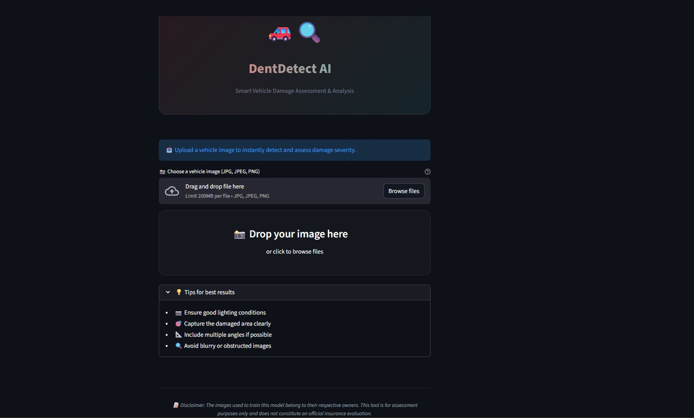
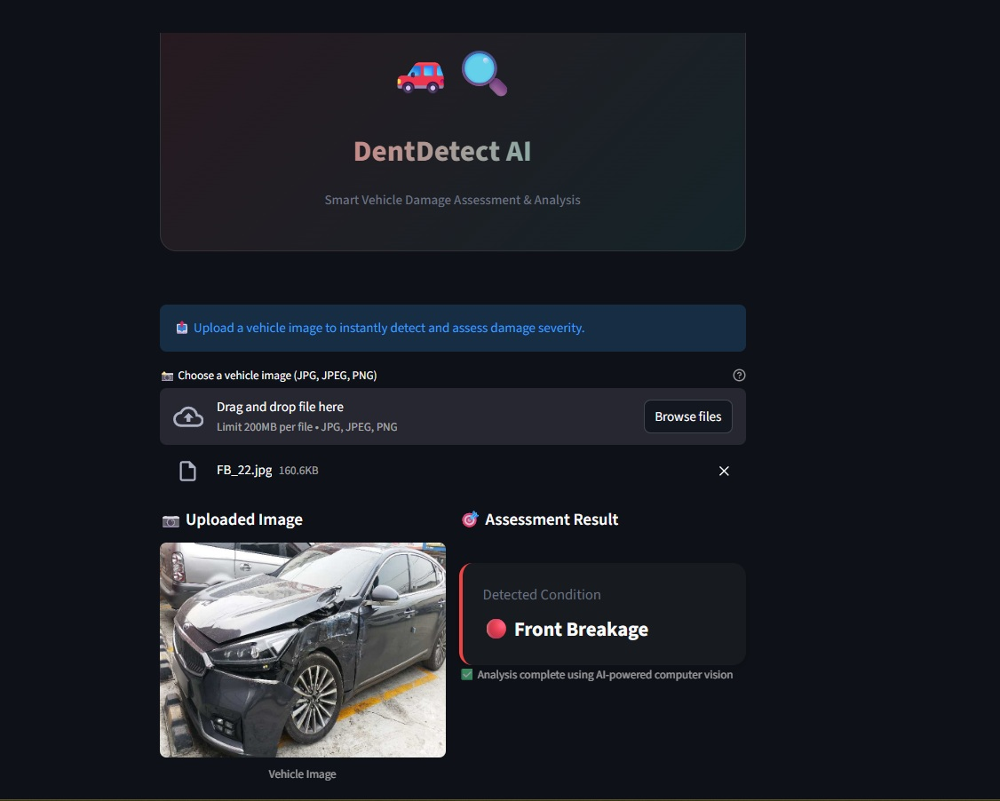
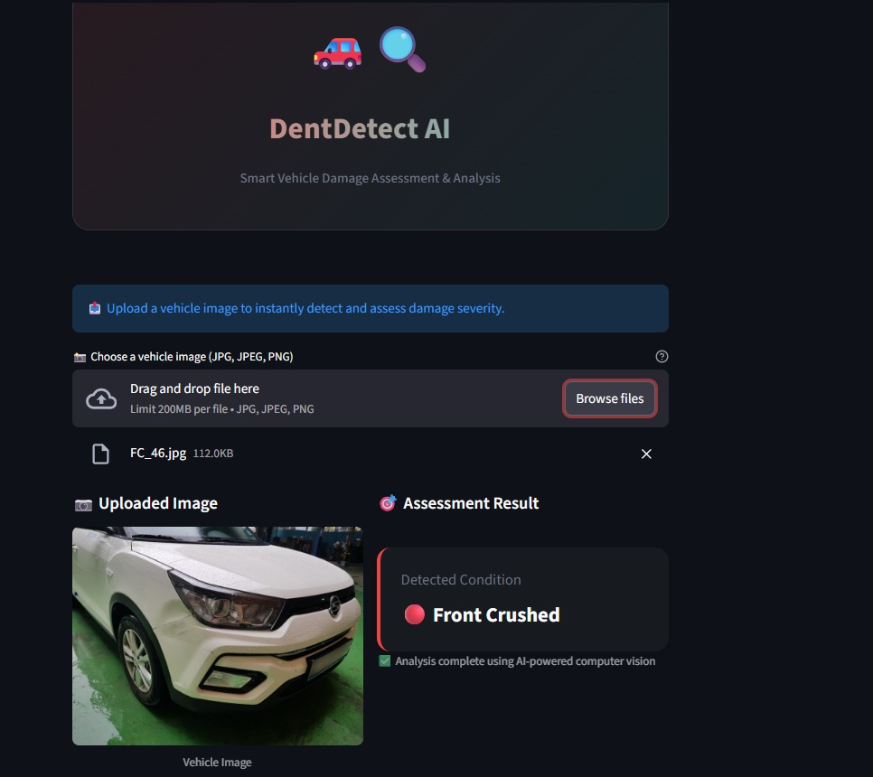
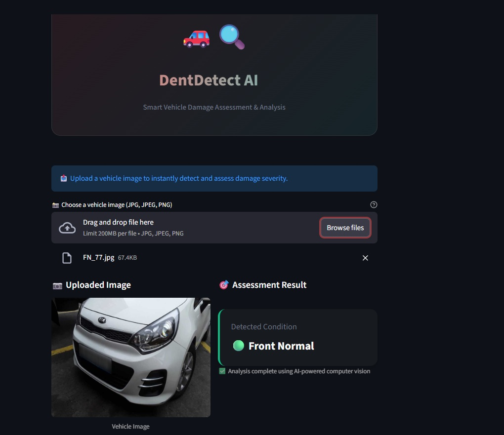
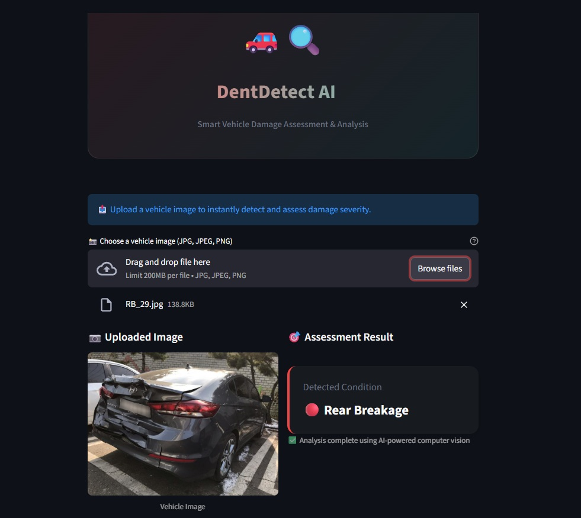
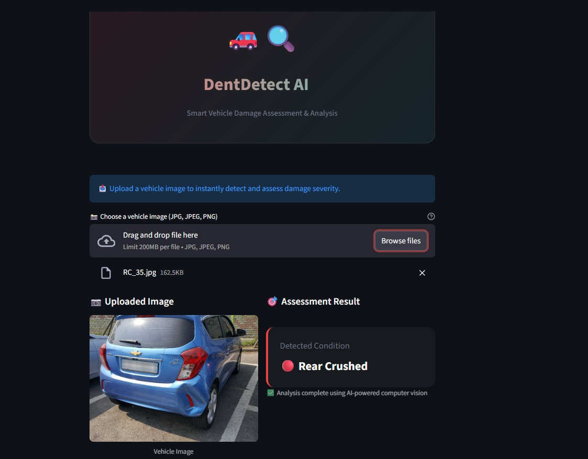
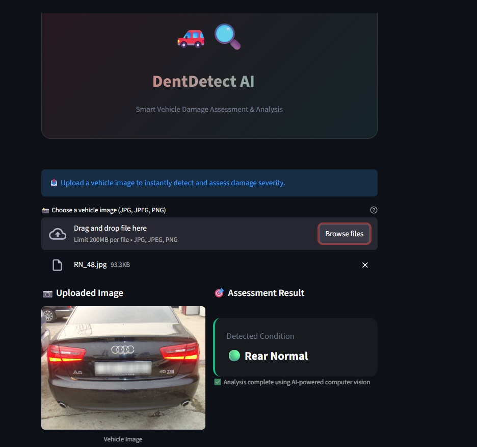
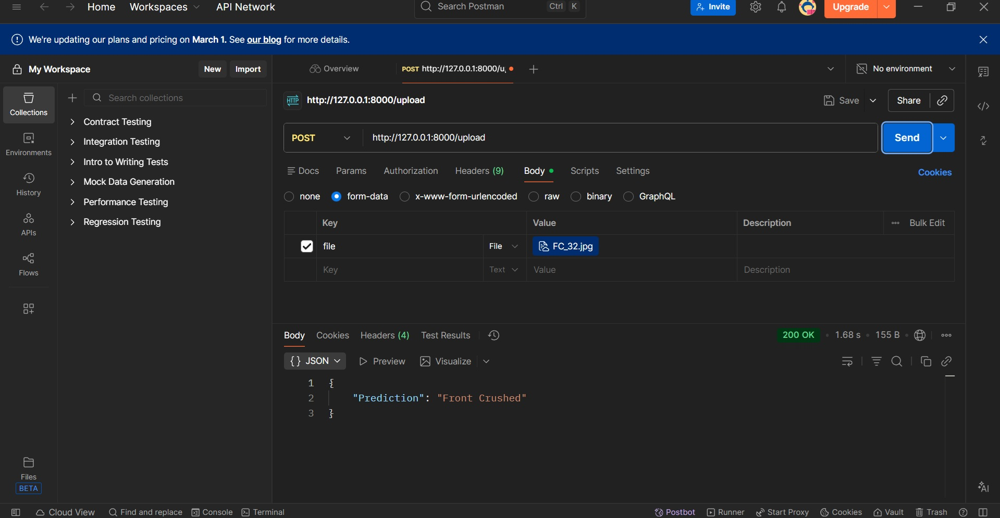

<p align="center">
  
</p>

<h2 align="center">🚗 DentDetect AI | Smart Vehicle Damage Assessment</h2>
<p align="center"><b>AI-powered car damage detection that classifies vehicle condition into six categories using deep learning.</b></p>

<p align="center">
  <a href="https://streamlit.io/"></a>
  <a href="https://pytorch.org/"></a>
  <a href="https://pytorch.org/vision/stable/index.html"></a>
  <a href="https://fastapi.tiangolo.com/"></a>
  <a href="https://pillow.readthedocs.io/"></a>
  <a href="https://optuna.org/"></a>
</p>

<p align="center">
  <b>Deep Learning:</b> PyTorch & Transfer Learning &nbsp; | &nbsp; <b>Models:</b> ResNet50 & EfficientNet-B0 &nbsp; | &nbsp; <b>Deployment:</b> FastAPI + Streamlit
</p>

<p align="center">
  This project uses convolutional neural networks with transfer learning to automatically detect and classify vehicle damage from images, achieving 80.70% validation accuracy.
</p>

---

DentDetect AI is a machine learning proof-of-concept that automatically assesses vehicle damage by analyzing car images. The system classifies damage into six distinct categories across front and rear views, leveraging pre-trained CNN architectures optimized through hyperparameter tuning to deliver reliable automated damage assessment.

---

## Features

- **6-Class Damage Classification**: Categorizes vehicle condition into Front Normal, Front Breakage, Front Crushed, Rear Normal, Rear Breakage, and Rear Crushed.
- **Transfer Learning**: Utilizes pre-trained ResNet50 and EfficientNet-B0 architectures for robust feature extraction.
- **High Accuracy**: Achieved 80.70% validation accuracy using ResNet50 with fully connected layer optimization via Optuna hyperparameter tuning.
- **Dual Interface**: Access via Streamlit web interface or REST API through FastAPI backend.
- **Real-time Inference**: Fast prediction on uploaded car images with confidence scoring.
- **Optimized Architecture**: Fine-tuned FC layers with automated hyperparameter optimization.
- **Modular Design**: Separate backend (FastAPI) and frontend (Streamlit) for scalable deployment.
- **GPU Acceleration**: PyTorch backend supports CUDA for accelerated inference.

---

## Model Performance

| Model Architecture | Validation Accuracy |
|---|---|
| EfficientNet-B0 (Pre-trained) | 65.04% |
| ResNet50 (Pre-trained) | 77.00% |
| ResNet50 + FC Layer + Optuna Tuning | **80.70%** |

---

## Screenshots

### 1. Streamlit Frontend Interface


### 2. Image Upload & Prediction (Predictions for front images)




### 3. Image Upload & Prediction (Predictions for rear images)




### 4. Postman API Testing


---

## Folder Structure

```
Car_Damage_Detection/
│
├── .gitignore                        # Git ignore file
├── Artifacts/                        # Frontend prediction screenshots
│
├── core/                             # Shared logic (used by Streamlit & FastAPI)
│   ├── __init__.py
│   ├── model_definition.py           # Neural network architecture
│   └── model_helper.py               # Prediction utilities
│
├── models/
│   └── saved_model.pth               # Trained model weights
│
├── fastapi_backend/                  # FastAPI backend server
│   └── server.py                     # FastAPI server entry point
│
├── streamlit_app/                    # Streamlit frontend application
│   ├── app.py                        # Frontend UI v1
│   └── app_v2.py                     # Frontend UI v2 (Recommended)
│
├── training/
│   └── dataset/                      # Training dataset (not included in repo)
│
├── car_damage_detection.ipynb        # Model training notebook (not included in repo)
├── requirements.txt                  # Python dependencies
└── README.md                         # Project documentation

```

---

## Setup Instructions

### Prerequisites

- Python 3.10 or higher
- Git
- CUDA-capable GPU (optional, for faster inference)

### 1. Clone the Repository

```bash
git clone https://github.com/inv-fourier-transform/dentdetect-ai.git
cd Car_Damage_Detection
```

### 2. Create and Activate a Virtual Environment

```bash
python -m venv venv
# On Windows:
venv\Scripts\activate
# On macOS/Linux:
source venv/bin/activate
```

### 3. Install Dependencies

```bash
pip install -r requirements.txt
```

### 4. Download Model Weights

Place the trained model file `saved_model.pth` in:

- `/models/`

---

## Running the Application

### Method 1: FastAPI Backend (for API access)

Navigate to the backend directory and start the server:

```bash
uvicorn fastapi_backend.server:app --reload --host 0.0.0.0 --port 8000
```

The API will be available at:

```
http://localhost:8000
```

#### Testing with Postman

1. Open Postman and create a new request  
2. Set request type to POST and enter URL: `http://localhost:8000/upload`  
3. Go to Body tab → Select **form-data**  
4. Add key-value pair:
   - Key: `file` (type: File)
   - Value: Select your car image file (JPG/PNG)
5. Click Send and receive JSON response:
   ```json
   {
     "Prediction": "Front Breakage"
   }
   ```
6. Alternative test endpoint: Send GET request to `http://localhost:8000/hello` to verify server is running

---

### Method 2: Streamlit Frontend (for Web UI)

Open a new terminal, navigate to the streamlit_app directory, and run:

```bash
streamlit run streamlit_app/app_v2.py
```

### Access the Application

Open your browser and go to:

```
http://localhost:8501
```

#### Using the Streamlit Interface

1. Upload Image: Click "Browse files" or drag-and-drop a car image  
2. View Preview: Uploaded image displays automatically  
3. Click Predict: System processes the image and displays:
   - Predicted damage category
   - Visual indicator (color-coded result)
4. Upload New Image: Repeat with different images for batch testing  

---

## API Endpoints

| Endpoint | Method | Description |
|---|---|---|
| `/hello` | GET | Health check endpoint |
| `/upload` | POST | Upload image file and receive damage classification |

### Request Format (POST /upload)

- **Content-Type**: `multipart/form-data`
- **Body**: File field named `file` containing JPG/PNG image

### Response Format

```json
{
  "Prediction": "Front Crushed"
}
```

---

## Technical Architecture

- **Transfer Learning**: Leverages ImageNet pre-trained weights from ResNet50 and EfficientNet-B0
- **Custom FC Layers**: Optimized fully connected layers with dropout and batch normalization
- **Hyperparameter Optimization**: Optuna framework tunes learning rate, dropout rates, and layer dimensions
- **Data Augmentation**: Random rotations, flips, and color jittering for robustness
- **Loss Function**: Cross-entropy loss with class weighting for imbalanced dataset

---

## Dataset

- **Total Images**: ~3,000 labeled car images
- **Classes**: 6 damage categories (3 front × 3 rear conditions)
- **Training Split**: 80% training, 20% validation
- **Note**: Dataset not included in repository due to client ownership rights

---

## Model Training (Optional)

To retrain the model with your own data:

1. Organize dataset into 6 class folders  
2. Update paths in `car_damage_detection.ipynb`  
3. Run training cells with Optuna hyperparameter search  
4. Export best model to `saved_model.pth`  

---

## Contributing

Contributions are welcome! Please open an issue or submit a pull request for improvements, bug fixes, or feature enhancements.

---

## License

This project is licensed under the MIT License.

---

*Because guessing repair costs shouldn't be as unpredictable as the accident itself.*
